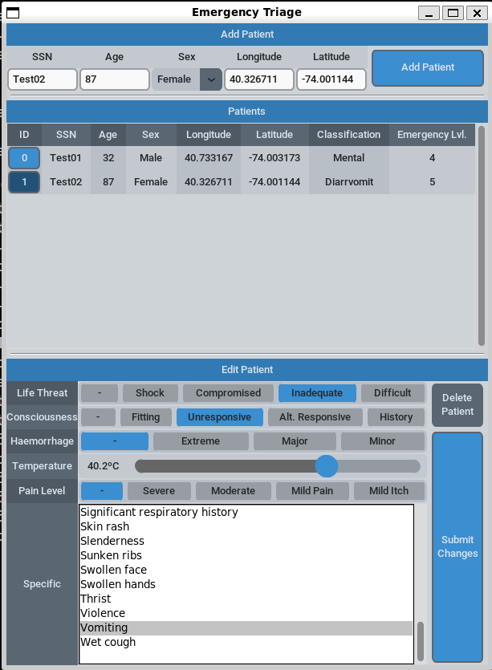

# :star: Automatic Emergency Triage

This project aims to be able to classify medical emergencies from a set of given symptoms according to the Manchester Triage Handbook (See Mackway-Jones, K., Marsden, J., & Windle, J. (Eds.). (2013). Emergency triage: Manchester triage group. John Wiley & Sons.).

## :book: Symptoms and classification

There are 5 general symptoms that quickly determine the urgency level of any emergency:
- Life Threat: Any direct threat to the vitals of the patient. A patient can suffer from (1) Shock, (2) Compromised breathing, (3) Inadequate breathing or (4) Difficult breathing.
- Conciousness Alterations: Any change in the normal consciousness level of the patient. A patient can suffer from (1) Fitting, (2) Unresponsive, (3) Altered but repond to voice, (4) History of consciousness alterations.
- Haemorrhage: Any uncontrolled bleeding wound. There are 3 types: (1) Extreme, (2) Major, (3) Minor.
- Temperature: Alterations to body temperature. > 41.0ºC (Very Hot), > 38.5ºC (Hot), > 37.1ºC (Warm), < 35.0 (Cold).
- Pain Level: Level of pain shwon by the patient. Can be (1) Severe, (2) Moderate, (3) Mild pain, or (4) Mild itch.

In addition to these general symptoms, there is a large number of specific symptoms needed to pinpoint the cause (clinical classification) of the emergency. We have simplified the problem to only classify the following emergencies: (1) Mental, (2) Palpitations, (3) Asthma, (4) Allergy and (5) Diarrhea and Vomit.

## :older_man: Patients

Patients are modelled with the following fields:
- SSN: Social Security Number
- Age: Age of the patient in years.
- Sex: Male or female.
- Longitude and Latitude: Coordinates of the patient.

Each patient can have any number of symptoms, general or specific. Depending on these symptoms they will be assigned an Urgency Level from 1 (Minimum) to 5 (Maximum), and a clinical classification if possible.

## :computer: Architecture and pattern matching

A GUI application in TKinter has been developed to enable operators to create patients and assigns symptoms to them.

The python application does not classify or evaluate the urgency of the symptoms, it instead publishes them through RabbitMQ so that a Complex Event Processing (CEP) engine can process them remotely. The CEP schemas and patterns can be found in the patterns and schemas directories of this repo.

The python application also subscribes to a different RabbitMQ queue to get all the patterns matches, thus gathering the urgency levels and clinical classifications. It automatically shows the assessment in the Patients tab for the operator to see.

This repo does not include the CEP code used to match the patterns, but it should be simple enough to implement using a tool like MuleSoft or the like.

